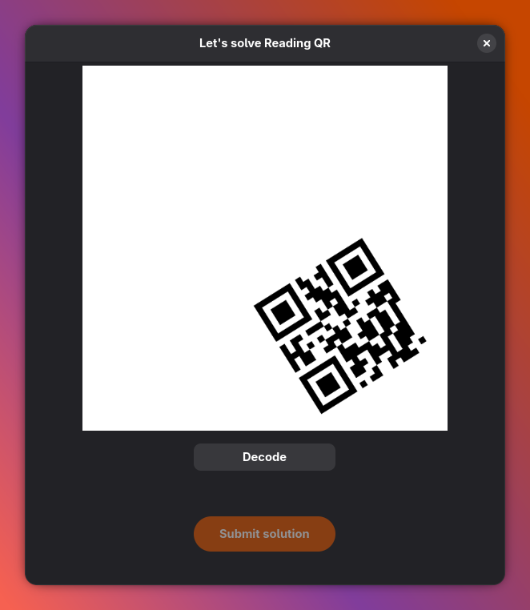
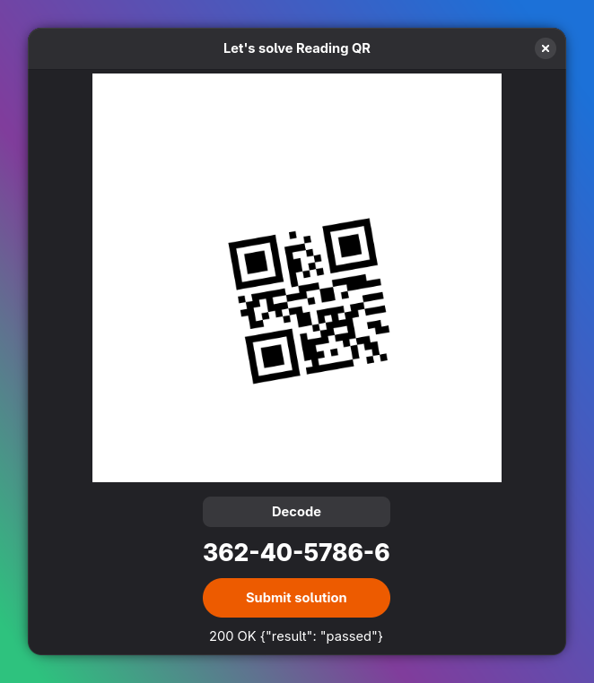

# reading_qr_rust

Small Rust CLI for the Hackattic “Reading QR” challenge.

## Screenshots

Initial QR prompt:



Decoded + submitted successfully:



## Prerequisites

- Rust toolchain (stable)

## Build

```bash
cargo build
```

## Run

```bash
cargo run
```

## Notes

- Expects the challenge input as defined by Hackattic.
